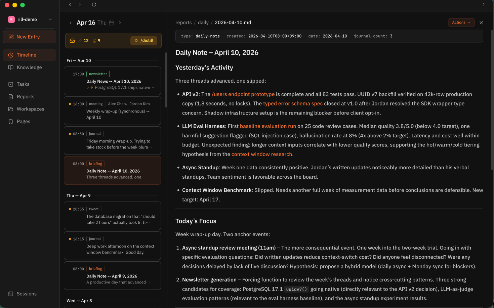
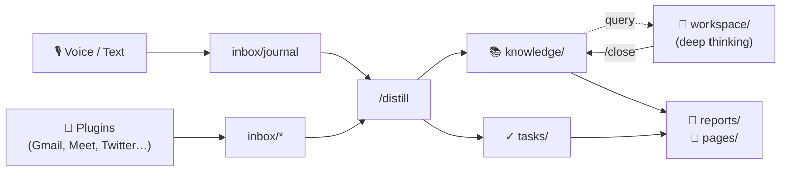

<p align="center">
  <picture>
    <source media="(prefers-color-scheme: dark)" srcset="assets/rill-logo-dark.svg">
    <source media="(prefers-color-scheme: light)" srcset="assets/rill-logo-light.svg">
    
  </picture>
</p>

<p align="center"><strong>AI remembers. Rill thinks.</strong></p>

<p align="center">
  <a href="https://rill.md">Website</a> ·
  <a href="https://github.com/rillmd/rill/releases/latest">Download</a> ·
  <a href="SPEC.md">Spec</a> ·
  <a href="docs/architecture.md">Architecture</a>
</p>

---

Rill is a personal knowledge management system powered by [Claude Code](https://docs.anthropic.com/en/docs/claude-code). It turns fragments of thought — spoken, typed, clipped, forwarded — into structured, searchable knowledge you own.

Everything Rill produces is plain Markdown. Git is the single source of truth. Claude Code is the processor. You keep all of it on your own machine.

> **Status**: v0.1 public preview. Expect rough edges, sharp changes, and short iteration cycles. [Report issues](https://github.com/rillmd/rill/issues).

## Why Rill

Most PKM tools are filing cabinets: they store what you put in, exactly how you put it in. Rill is a thinking layer on top of one: you drop in raw input (a voice memo, a meeting transcript, a clipped tweet), and Claude Code distills it into atomic notes, tasks, and entity records. The originals stay immutable; the distilled layer is evergreen.

You interact with it through natural language in Claude Code — no custom UI to learn. The files are Markdown, so every tool you already use (Obsidian, VS Code, `grep`) keeps working.

## Screenshots

<!-- TODO(ss): replace with real screenshots -->
<p align="center">
  
</p>
<p align="center"><em>The Rill desktop app. Timeline view of journal, meetings, and clips.</em></p>

## How It Works

<!-- AUTO-GENERATED:ia-diagram-start -->
<!-- DO NOT EDIT: run 'rill docs regenerate' to update -->



<!-- AUTO-GENERATED:ia-diagram-end -->

Rill organizes data into layers: **input** (immutable, what you captured), **thinking** (workspaces for deep work), **knowledge** (evergreen distilled notes + entities), **action** (tasks), and **output** (daily briefings, newsletters, aggregated pages). Skills like `/distill`, `/focus`, and `/briefing` move data across the layers. See [docs/architecture.md](docs/architecture.md) for the full flow.

## Desktop App

A native macOS app ships alongside the CLI. Use the app for reading and navigation; use Claude Code in the terminal for creation and thinking.

- **Download**: latest DMG at [github.com/rillmd/rill/releases](https://github.com/rillmd/rill/releases/latest) (arm64 + x64, signed & notarized)
- **Or install via LP**: [rill.md](https://rill.md)

The app and CLI read the same vault. Start with either; they stay in sync through the filesystem.

## Core Skills

<!-- AUTO-GENERATED:skills-start -->
<!-- DO NOT EDIT: run 'rill docs regenerate' to update -->

| Skill | What it does |
|-------|--------------|
| `/onboarding` | First-time setup and tutorial |
| `/morning` | Full morning routine: sync → distill → briefing → newsletter |
| `/distill` | Extract knowledge, tasks, and entities from inbox entries |
| `/briefing` | Generate today's daily note from recent activity |
| `/newsletter` | Generate a research report based on your interests |
| `/focus` | Start or resume a deep thinking workspace |
| `/close` | Complete a workspace and distill insights to knowledge |
| `/page` | Create and update human-facing aggregated views |
| `/sync` | Run plugin adapters to pull external sources |
| `/solve` | AI-assisted execution of a task ticket |
| `/inspect` | Audit knowledge note metadata quality |
| `/repair` | Fix metadata issues detected by `/inspect` |
| `/maintain` | Run scheduled maintenance passes |
| `/eval` | Benchmark skill performance |
| `/clip-tweet` | Ingest a tweet URL into the web-clips layer |
| `/plugin` | Interactive plugin management |

<!-- AUTO-GENERATED:skills-end -->

Every skill is a single Markdown file in `.claude/commands/`. Read the file to see exactly what it does — there is no hidden logic.

## Quick Start

### Requirements

- macOS 12+ (for the desktop app), or any OS with a terminal (for CLI only)
- [Claude Code](https://docs.anthropic.com/en/docs/claude-code) with a Max Plan
- Git, `jq`

### Install

```bash
curl -fsSL https://raw.githubusercontent.com/rillmd/rill/main/install.sh | bash
```

The installer clones Rill, creates a vault at `~/Documents/my-rill`, and symlinks the `rill` CLI. It does not modify your shell profile; it prints the PATH line for you to add.

### First run

```bash
cd ~/Documents/my-rill
claude
```

Then type `/onboarding`. This walks you through a first journal entry, your first `/focus` + `/distill` cycle, and the "ask Claude anything" muscle that you'll use daily.

## Daily Usage

```bash
# Capture a thought
rill log "Ideas about project architecture"

# Run the morning routine (sync + distill + briefing + newsletter)
claude "/morning"

# Dive deep on a topic
claude "/focus API redesign"

# Clip a web page or tweet
rill clip https://example.com/interesting-article
```

Inside Claude Code, you can also just ask questions in natural language: *"What did I decide about X last week?"* / *"Summarize my meetings with the finance team."* Claude reads the relevant files directly.

## Vault Structure

<!-- AUTO-GENERATED:vault-structure-start -->
<!-- DO NOT EDIT: run 'rill docs regenerate' to update -->

```
my-rill/
├── inbox/
│   ├── journal/        # Your thoughts (rill log)
│   ├── meetings/       # Meeting notes
│   ├── tweets/         # Saved tweets
│   ├── web-clips/      # Web articles
│   └── sources/        # Other external input
├── knowledge/
│   ├── me.md           # Your interest profile
│   ├── notes/          # Atomic knowledge (distilled)
│   ├── people/         # Person entities
│   ├── orgs/           # Organization entities
│   └── projects/       # Project profiles
├── workspace/          # Deep thinking sessions
├── tasks/              # Task tickets
├── reports/
│   ├── daily/          # Daily notes (/briefing)
│   └── newsletter/     # Research reports (/newsletter)
├── pages/              # Aggregated views
├── taxonomy.md         # Tag vocabulary
└── CLAUDE.md           # Claude Code instructions
```

<!-- AUTO-GENERATED:vault-structure-end -->

## The `inbox/` Drop Zone

Not sure which inbox subdirectory a file belongs in? Drop it into `inbox/sources/` — or directly into `inbox/`:

```bash
cp ~/Downloads/random-notes.md ~/Documents/my-rill/inbox/sources/
# or simply
cp ~/Downloads/random-notes.md ~/Documents/my-rill/inbox/
```

`/distill` processes both locations. It organizes the file, extracts tasks, and creates knowledge entries through a generic pipeline — the same one that runs on meetings or clipped articles. If `/distill` recognizes the content as a more specific type (a meeting, a tweet), it may reclassify.

### What works

- Any **Markdown file** in `inbox/sources/` or directly under `inbox/`
- Frontmatter is optional; if missing, Rill infers `created` and `source-type` automatically

### What doesn't

- Non-Markdown files (PDFs, images, raw audio). Transcribe or summarize them in a Markdown file first
- Binary files containing personal information — these should stay out of Git; commit only the Markdown transcript

For recurring external sources (Gmail, Google Meet, Twitter), use a [plugin](plugins/README.md) instead — plugins have type-specific distillation that extracts richer structure from known formats.

## Privacy & Data Flow

Rill is local-first:

- **Your data lives as plain Markdown** on your disk. Nothing is synced to a Rill-operated server. There is no Rill server.
- **Your vault is a Git repository**. Keep it local, push it to a private GitHub repo, self-host it — whatever fits your trust model.
- **AI processing happens through Claude Code**. When you invoke a skill or ask a question, Claude Code sends the relevant file contents to Anthropic's API under your Max Plan subscription. Rill itself holds no API keys and makes no network calls.
- **No telemetry**. The `rill` CLI is a bash script. It does not phone home. Search the code: [bin/rill](bin/rill).

You can audit everything Rill does by reading the bash script and the skill files. Nothing runs except what you invoke.

## How It Compares

Rill is not a note-taking app — it's a distillation layer. If you want a beautiful editor, use [Obsidian](https://obsidian.md). If you want cloud-hosted AI retrieval, use [mem.ai](https://mem.ai). If you want an MCP-based knowledge graph, use [Basic Memory](https://memory.basicmachines.co).

Rill's value is: you keep the files locally, and Claude Code distills them in place. The thinking happens in Claude Code, not in a separate app you have to learn.

## Community & Support

- **Bugs & features**: [GitHub Issues](https://github.com/rillmd/rill/issues)
- **Discussions**: [GitHub Discussions](https://github.com/rillmd/rill/discussions)
- **Updates**: [@rill_app on X/Twitter](https://x.com/rill_app)

Discord is not offered at this stage — GitHub is the single channel.

## Deep Dive

Rill's behavior lives in its source files. When you run `claude` inside a Rill vault, Claude Code reads these to answer your questions — but you can read them directly too:

| Area | File(s) |
|------|---------|
| Information architecture | [docs/architecture.md](docs/architecture.md) |
| Skill behavior | [`.claude/commands/*.md`](.claude/commands) |
| Directory conventions | [`.claude/rules/rill-*.md`](.claude/rules) |
| File placement rules | [`inbox/<type>/CLAUDE.md`](inbox) |
| Plugin authoring | [plugins/README.md](plugins/README.md) |
| Writing your own skill | [docs/creating-skills.md](docs/creating-skills.md) |
| Full specification | [SPEC.md](SPEC.md) |

You rarely need to read any of these directly — just ask Claude. They exist for transparency and audit.

## Updating

```bash
cd ~/src/rillmd/rill && git pull
rill update
```

`rill update` syncs the latest skills and rules to your vault. Your personal data and custom skills are never touched. Your vault's own git history stays intact.

## Plugins

Rill supports plugins for ingesting data from external services. The `plugins/` directory lists what ships by default; see [plugins/README.md](plugins/README.md) for how the plugin system works and how to author your own.

Individual plugins are installed with `rill plugin install <name>` and enabled with `rill plugin enable <name>`.

## Documentation

- [docs/architecture.md](docs/architecture.md) — Information architecture overview
- [SPEC.md](SPEC.md) — Full system specification
- [docs/creating-skills.md](docs/creating-skills.md) — Authoring your own skill
- [plugins/README.md](plugins/README.md) — Plugin system and authoring

## Acknowledgments

Rill is inspired by years of using [Obsidian](https://obsidian.md) and watching the Claude Code ecosystem mature. The distillation pipeline owes a debt to Andy Matuschak's evergreen notes, Andrej Karpathy's LLM Wiki pattern, and [Basic Memory](https://memory.basicmachines.co)'s MCP-first approach.

## License

[MIT](LICENSE)
