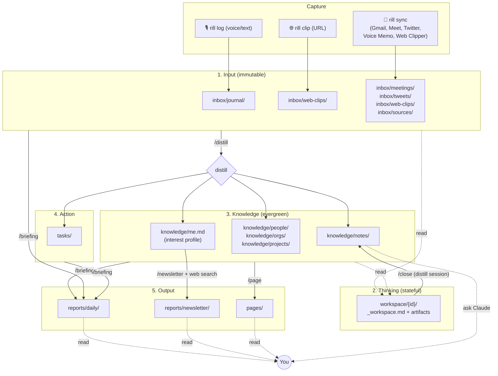

# Rill Information Architecture

This document describes how information flows through Rill: where data enters, how it is transformed, where it lives, and how it surfaces back to you. If you read one design document, read this.

> **Scope**: conceptual architecture. For the exact state machine, frontmatter schemas, and pipeline specs, see [SPEC.md](../SPEC.md). For the one-screen overview, see the top of [../README.md](../README.md).

## 1. Design Principles

Rill rests on five principles that shape every layer below.

| Principle | Implication |
|-----------|-------------|
| **Filesystem is the database** | Everything is a Markdown file on your disk. No dedicated DB, no index file you have to rebuild. `grep` works. |
| **Git is the transaction log** | Every change is a commit. Undo, bisect, and blame work exactly as they do for code. |
| **Claude Code is the processor** | Distillation, summarization, analysis, search — all performed by Claude Code skills. No background daemon, no separate agent runtime. |
| **Input is append-only** | Files in `inbox/` are never edited after capture. Derived views live elsewhere. This makes Git history meaningful and `/distill` idempotent. |
| **Distillation is automated, deletion is manual** | Claude Code writes into `knowledge/`, `tasks/`, and `reports/` for you. Only you decide what to delete. |

These are not aesthetic preferences. Each principle closes off a class of failures that plague other PKM systems (corrupt indexes, lock-in to a proprietary format, losing the ability to audit changes).

## 2. Five-Layer Model

Rill organizes data into five layers. Each layer has a single responsibility and a separate mutability contract.

```
┌─────────────────────────────────────────────────────────┐
│ 1. Input Layer    inbox/         immutable, append-only │
├─────────────────────────────────────────────────────────┤
│ 2. Thinking Layer workspace/     stateful, long-lived   │
├─────────────────────────────────────────────────────────┤
│ 3. Knowledge Layer knowledge/    evergreen, distilled   │
├─────────────────────────────────────────────────────────┤
│ 4. Action Layer    tasks/        ticketed, statefully   │
├─────────────────────────────────────────────────────────┤
│ 5. Output Layer    reports/, pages/  generated views    │
└─────────────────────────────────────────────────────────┘
```

### Layer 1 — Input (`inbox/`)

Everything you capture lands here first, in a subdirectory by source type.

| Subdirectory | What goes in | Typical writer |
|--------------|--------------|----------------|
| `inbox/journal/` | Your thoughts. Voice memos, typed notes | `rill log`, `rill i` |
| `inbox/meetings/` | Meeting transcripts, notes | Plugins (Google Meet, voice-memo) |
| `inbox/tweets/` | Saved tweets | Plugin (twitter) or `rill clip` |
| `inbox/web-clips/` | Web articles | Plugin (web-clipper) or `rill clip` |
| `inbox/sources/` | **Anything else** — a raw drop zone | Manual, misc. plugins |

**The `sources/` subdirectory is the catch-all**. If you have a Markdown file and no opinion about how Rill should classify it, drop it there — or directly under `inbox/`. `/distill` will organize it through a generic pipeline and may reclassify to a more specific type if it recognizes one.

**Contract**: files here are never modified after capture. `_organized/` subfolders hold cleaned-up versions for AI consumption, but the originals are preserved. Binary files (PDFs, images) should be wrapped in a Markdown file with a transcript or summary; the originals stay out of Git.

Governing rule: [`.claude/rules/rill-inbox.md`](../.claude/rules/rill-inbox.md). Per-type conventions live in each subdirectory's `CLAUDE.md`.

### Layer 2 — Thinking (`workspace/`)

Workspaces are where you (with Claude Code as pairing partner) do deep work. Each workspace is a directory holding an `_workspace.md` meta file plus numbered artifacts (`001-research.md`, `002-analysis.md`, …).

Workspaces are **stateful**: they have `status: active | on-hold | completed`, a goal, and accumulated artifacts. They are explicitly *not* areas (ongoing responsibility zones) — every workspace has completion conditions, which `/close` enforces.

Governing rule: [`.claude/rules/rill-workspace.md`](../.claude/rules/rill-workspace.md).

### Layer 3 — Knowledge (`knowledge/`)

The distilled, evergreen layer. What Rill knows *about you and for you*.

| Subdirectory | Purpose |
|--------------|---------|
| `knowledge/me.md` | Your interest profile. Drives `/newsletter` targeting |
| `knowledge/notes/` | Atomic knowledge notes — one fact/insight per file, flat |
| `knowledge/people/` | Person entities (id, key facts, relationships) |
| `knowledge/orgs/` | Organization entities |
| `knowledge/projects/` | Project entities (goals, current focus, watch list) |

**Evergreen contract**: before creating a new note, check for existing ones; update if overlap exists. No duplicates. Entities (people/orgs/projects) are hubs, referenced from notes via `mentions:` frontmatter.

Governing rule: [`.claude/rules/rill-knowledge.md`](../.claude/rules/rill-knowledge.md).

### Layer 4 — Action (`tasks/`)

Every actionable item is a ticket file (`tasks/{slug}.md`) with explicit `status`, optional `due` / `scheduled`, and a narrative body (Goal / Background / Context / Request / History).

Tasks are independent of workspaces — a task can exist without a workspace, and a workspace can exist without producing tasks. They link via `mentions:` frontmatter when related.

Governing rule: [`.claude/rules/rill-tasks.md`](../.claude/rules/rill-tasks.md).

### Layer 5 — Output (`reports/`, `pages/`)

AI-generated or AI-assisted views for human consumption.

- `reports/daily/` — daily notes from `/briefing` (today's focus + yesterday's activity)
- `reports/newsletter/` — research reports from `/newsletter` (tailored to your interests)
- `reports/eval/` — metadata quality analyses from `/eval`
- `pages/` — human-facing aggregated views (Materialized Views), each with a `.recipe.md` pair describing its purpose and sources

`reports/` is regenerated periodically; `pages/` is semi-manual (updated through `/page` when the underlying knowledge changes).

Governing rule: [`.claude/rules/rill-outputs.md`](../.claude/rules/rill-outputs.md).

## 3. Flow Diagram

The full path from capture to surface:



## 4. Data Lifecycle

### Mutability per layer

| Layer | Who writes | Who deletes | When mutated |
|-------|-----------|-------------|--------------|
| Input (`inbox/`) | `rill log`, plugins | **User only** | Never after creation (append-only). `_organized/` may be regenerated |
| Thinking (`workspace/`) | Claude (via skills), user | User | While `status: active`; frozen after `/close` |
| Knowledge (`knowledge/`) | Claude (via `/distill`, `/close`) | **User only** | Evergreen: Claude updates existing files rather than adding new ones |
| Action (`tasks/`) | Claude, user | User | Status changes over life cycle: draft → open → done (or cancelled) |
| Output (`reports/`) | Claude (regenerated) | User (or overwrite) | Daily regen; historical files kept |
| Output (`pages/`) | Claude (via `/page`) + user | User | On demand |

### Git as transaction log

Every write is a Git commit (the PostToolUse hook + `rill push` pattern). This gives you:

- **Undo**: revert the commit
- **Audit**: `git blame` on any fact
- **Branching**: try a distillation on a branch before merging
- **Portability**: your vault moves with your Git history

`.processed` files in each `inbox/*/` subdirectory track which inputs have been distilled already, which is how `/distill` stays idempotent.

### PII boundaries

Contact information (email, phone) is restricted to `knowledge/people/` and `knowledge/orgs/`. All other layers treat these as leakage. This keeps the audit surface small.

Binary files with PII (scanned PDFs, photos) are gitignored by convention — the vault tracks only Markdown.

## 5. Processing Pipeline

Every skill is a single Markdown file in `.claude/commands/`. The file *is* the skill — reading it shows you exactly what it does, with no hidden logic.

| Skill | Reads | Writes | Purpose |
|-------|-------|--------|---------|
| `/distill` | `inbox/**/*.md` (unprocessed) | `knowledge/notes/`, `knowledge/people/`, `knowledge/orgs/`, `knowledge/projects/`, `tasks/`, `inbox/**/.processed` | Core distillation |
| `/focus` | theme + `knowledge/`, `inbox/` | `workspace/{new-id}/_workspace.md` | Start or resume a thinking session |
| `/close` | `workspace/{id}/` | `workspace/{id}/_summary.md`, `knowledge/notes/`, `status: completed` | Complete a workspace, distill its insights |
| `/briefing` | `reports/daily/` (yesterday), `inbox/journal/` (today), `tasks/` | `reports/daily/{today}.md` | Daily note |
| `/newsletter` | `knowledge/me.md`, web | `reports/newsletter/{today}.md` | Research report |
| `/page` | canonical sources + `{id}.recipe.md` | `pages/{id}.md` | Refresh a materialized view |
| `/sync` | plugin adapters (`plugins/*/adapter.sh`) | `inbox/*/` | Pull from external services |
| `/morning` | — (orchestrator) | `/briefing` + `/newsletter` (parallel) | Daily user-facing reports. Maintenance (`/sync`, `/distill`) is intentionally separate — see [scheduling guide](./guides/scheduling.md) |
| `/onboarding` | — (tutorial) | first vault files | First-time setup |
| `/inspect` / `/repair` / `/maintain` | `knowledge/` | metadata fixes | Quality maintenance |
| `/eval` | standard test prompts | `reports/eval/` | Measure skill quality |
| `/solve` | `tasks/{slug}.md` | task body, ad-hoc output | AI-assisted execution of a task |
| `/clip-tweet` | tweet URL | `inbox/tweets/` | Single-tweet ingestion |
| `/plugin` | `plugins/` | `plugins/.installed`, `plugins/.enabled` | Interactive plugin management |

The authoritative description of each skill lives in its source file. Open [`.claude/commands/`](../.claude/commands) and read.

## 6. Extension Points

Rill is designed to be extended. There are three places where you can add behavior.

### 6.1 Plugins (`plugins/{name}/`)

A plugin is a directory. Each plugin has a lifecycle of `available → installed → enabled` managed by `rill plugin {install,enable,disable,uninstall}`.

A plugin can provide:
- **Source**: an `adapter.sh` that pulls data into `inbox/*`
- **Workflow**: a `plugin.md` that defines a skill extending `/distill` or another pipeline
- **Hooks**: scripts that run on PostToolUse or PostCommit events

See [plugins/README.md](../plugins/README.md).

### 6.2 Custom skills (`.claude/commands/{your-skill}.md`)

A skill is a Markdown file with a `gui:` frontmatter block and a structured body (`## Arguments`, `## Procedure`). Personal skills live alongside official ones; `rill update` preserves yours.

See [docs/creating-skills.md](creating-skills.md) for the minimum template and how to use an existing skill as your scaffold.

### 6.3 Custom rules (`.claude/rules/personal-*.md`)

Rules are Markdown files that auto-load into every Claude Code turn, governing behavior across all skills. `personal-*.md` rules are yours and never overwritten by `rill update`. Use them for cross-repo routing, language preferences, team conventions.

## 7. Rationale

### Why Markdown?

Because Markdown is the PKM lingua franca. Your notes work in Obsidian, VS Code, `cat`, `grep`, any AI tool, and any future tool. No proprietary format can capture your thinking hostage.

### Why Git?

Because PKM data is as precious as source code and deserves the same audit and recovery tools. Git-native storage also means any pattern that works for code (branches, worktrees, remotes, hooks) works for your knowledge.

### Why Claude Code as processor (not SDK or custom agent)?

Because Claude Code already solves context loading, tool orchestration, and auth via Max Plan. Rebuilding any of those is months of work that doesn't improve the end product. Staying on the Claude Code harness means every improvement to Claude Code (memory, subagents, skills, plan mode) lands in Rill for free.

Rill is deliberately a Claude Code companion, not a Claude API application.

### Why immutable input?

Two reasons.

First, `/distill` must be **idempotent**: running it twice on the same input must not double-create notes. If input could mutate, `.processed` tracking would lie.

Second, Git blame on a derived note must point to a real source file. If input files drift, the audit trail breaks.

### Why entity files are flat, not hierarchical?

Hierarchy is brittle in PKM. You meet someone who works at Company A, later joins Company B, later does independent work. A tree forces you to choose one location. A flat entity pool with `mentions:` references lets the relationships evolve without moving files.

### Why skills are Markdown, not code?

Because reading a skill file must be the authoritative way to know what it does. A user who asks "what does `/distill` do?" should be able to read one file and get the answer — not trace through library calls. This also makes skills fork-friendly: copy the file, change a section, register as a personal skill.

## 8. See Also

- [../README.md](../README.md) — one-screen overview with the simplified flow
- [../SPEC.md](../SPEC.md) — authoritative state machine, schemas, exact semantics
- [../.claude/rules/rill-core.md](../.claude/rules/rill-core.md) — runtime rules entry point (auto-loaded by Claude)
- [creating-skills.md](creating-skills.md) — how to add your own skill
- [../plugins/README.md](../plugins/README.md) — plugin system

## Maintenance

This document is hand-maintained but guarded by `rill docs lint`, which verifies:

- Every directory listed here (`inbox/journal`, `knowledge/notes`, etc.) exists in the project structure
- Every skill mentioned (`/distill`, `/focus`, etc.) has a file in `.claude/commands/`
- Every rule file in `.claude/rules/rill-{inbox,knowledge,workspace,tasks,outputs}.md` links back to this document

Changes to the layer model or to any skill's data flow **must** be reflected here. The lint will fail the CI otherwise.
